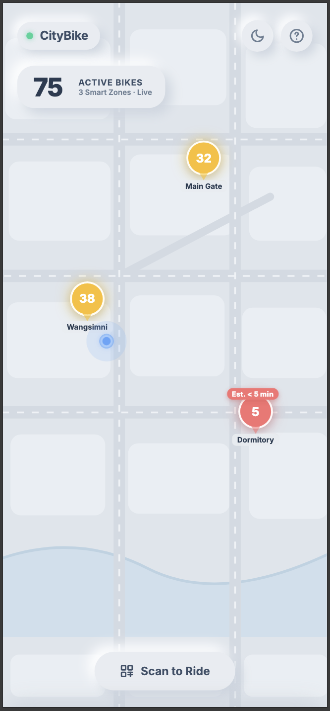
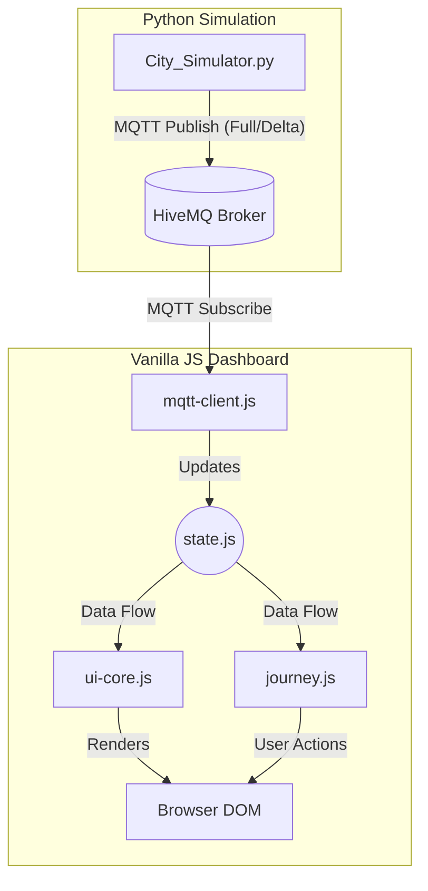

# 🚲 Seoul Smart City Bike-Sharing System


<div align="center">
  <br>
  
  <video src="assets/dark-mode-toggle.mov" width="48%" autoplay loop muted playsinline></video>
  <p><i>A tactile <b>Neumorphism UI</b> featuring high-contrast Dark Mode integration.</i></p>
  <br>
</div>

A real-time, event-driven smart city bike-sharing dashboard and simulation backend. Designed with a premium **Neumorphism** user interface and powered by MQTT, this project demonstrates a complete IoT telemetry flow, featuring dynamic predictive analytics and edge-case handling (e.g., RFID failures, geofencing).

<div align="center">
  <br>
  <video src="assets/data-forecast.mov" width="48%" autoplay loop muted playsinline></video>
  <video src="assets/ride-journey.mov" width="48%" autoplay loop muted playsinline></video>
  <p><i>Zero-dependency SVG trend charts & robust ride state machine.</i></p>
  <br>
</div>

---

## 📑 Table of Contents
1. [Core Features](#-core-features)
2. [How to Run](#-how-to-run)
3. [System Configuration](#️-system-configuration-configjson)
4. [System Architecture](#-system-architecture)
5. [Project Structure](#-project-structure)
6. [License](#-license)

---

## ✨ Core Features
* **Real-time MQTT Sync**: Employs delta-update payloads for optimized bandwidth, merging differential telemetry in real-time.
* **Predictive Analytics**: Features a rolling 3-hour history and an active net-flow calculation algorithm that predicts station depletion (`Est. < 5 min` badges).
* **Neumorphism & Dark Mode**: A tactile, premium UI built completely with Vanilla CSS, featuring one-click Dark Mode stored via local storage.
* **Complex State Machine**: A robust Vanilla JS state machine managing the full lifecycle of a user ride (Reservation → Geofence Checks → Riding Timer → 15s Verification → Return).
* **PWA Ready**: Can be installed as a native-like application on mobile devices.

---

## 🚀 How to Run

To start the system, you need to run both the "Backend Simulator" and the "Frontend Dashboard".

### 1. Start the Backend Simulator
The Python simulator generates synthetic bike traffic, computes net flow, and broadcasts states via MQTT to the public HiveMQ broker.
```bash
pip install -r requirements.txt
python3 City_Simulator.py
```

### 2. Open the Frontend Dashboard
Simply **double-click `index.html`** to open it directly in your web browser (no build steps required).

> 📱 **PWA Mode (App Installation)**: To install this dashboard as a native app on your phone, you must serve it over a local network (e.g., `python3 -m http.server 8000`). Open the local IP on your phone and tap **"Add to Home Screen"**.
> 
> 💡 **Tip**: This is a Mobile-first interface. If viewing on a desktop, press `F12` to open Developer Tools and switch to "Mobile View" for the intended visual experience.

---

## ⚙️ System Configuration (`config.json`)

To modify the simulation scenario, edit `config.json`:

* `"demo_mode"`: 
  * `"MORNING_RUSH"`: Bikes flow heavily toward the Main Gate (simulates a rapid depletion scenario).
  * `"RANDOM"`: Bikes move randomly between all stations.
* `"context"`: Change `"holiday"` to `true`, or add a concert name to `"event"`. The UI tags will reflect this context instantly.
* `"update_interval"`: Controls simulation speed. Set to `1.5` to power a high-speed demonstration mode (default is `3`).

---

## 🏗 System Architecture



To ensure long-term maintainability without complex build tools (Webpack/Vite), the frontend logic is decoupled into 5 domain modules under `js/`:
1. `state.js` - Centralized state management.
2. `mqtt-client.js` - Payload ingestion and Delta merging.
3. `chart-builder.js` - Zero-dependency SVG trend chart engine.
4. `ui-core.js` - DOM manipulation, Map rendering, and Theme toggling.
5. `journey.js` - State machine managing the ride flow.

Because they share the global scope safely, `index.html` can run locally via the `file://` protocol without strict CORS blocking.

---

## 📁 Project Structure

```text
smart-city-bike-dashboard/
├── City_Simulator.py    # Python backend generating simulation & MQTT payloads
├── config.json          # Configuration for stations, intervals, and demo modes
├── index.html           # Main PWA entry point
├── style.css            # Neumorphism design system & Dark Mode variables
├── app.js               # Global initialization & Service Worker registration
├── manifest.json        # PWA metadata configuration
├── sw.js                # Service Worker for offline caching
├── icon.svg             # SVG application icon
└── js/                  # Decoupled Vanilla JS domain modules
    ├── state.js         # Centralized state management
    ├── mqtt-client.js   # MQTT lifecycle & Delta merging logic
    ├── chart-builder.js # Zero-dependency SVG trend chart generator
    ├── ui-core.js       # DOM manipulation, Map rendering, Theme toggle
    └── journey.js       # User ride flow state machine
```

---

## 📄 License
Copyright (c) 2026 Wei-Chieh Hsia. All rights reserved.
